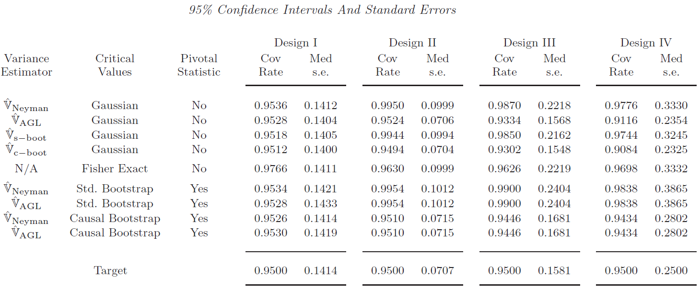
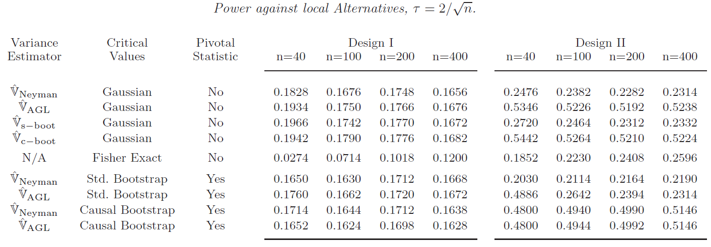
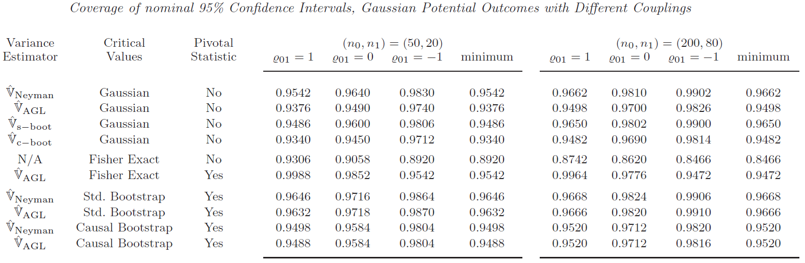
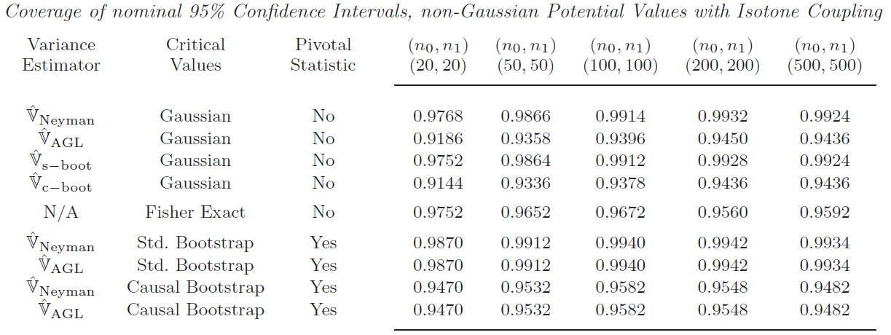

```{r setup, include=FALSE}
knitr::opts_chunk$set(echo = FALSE, fig.pos = "!ht", fig.asp = 0.618,
                      fig.width = 10, out.width = "100%")
```

# Introduction
## Background
- After applying a treatment $W_i \in \{0,1\}$, the outcome is $Y_i(W_i)$. 
- Causal effect: $Y(1) - Y(0)$.
\begin{alertblock}{Fundamental problem}
We can only observe one realization of $W$ at a time, i.e.,
\begin{align*}
\text{Causal effect} = \left\{\begin{aligned}&\ Y(1) - \text{??} \\ &\ \text{??} - Y(0) \end{aligned} \right. = \text{??}. 
\end{align*}
\end{alertblock}
- Parameter of interest:
$$
\tau_{ATE} = \frac{1}{N} \sum_{i=1}^N (Y_i(1) - Y_i(0)).
$$


## Assumption
\begin{alertblock}{Assumption 1.1. (Sampling Experiment)}
The population consists of $N$ units with potential
values $(Y_i(0), Y_i(1))_{i=1}^N$
which are i.i.d. draws from the distribution $F_{01}(y_0, y_1)$. The $n$ observed units are sampled at random and without replacement from the population, $$Y_i(0), Y_i(1) \!\perp\!\!\!\perp R_i$$
where we denote $q := n/N \in (0, 1]$.
\end{alertblock}

\begin{alertblock}{Assumption 1.2. (Complete Randomization)}
Treatment assignment is completely randomized, that is for each unit with $R_i = 1$ we have
$$(Y_i(0), Y_i(1)) \!\perp\!\!\!\perp W_i$$
where $W_i = 1$ for $n_1$ units selected at random and without replacement from the $n$ observations
with $R_i = 1$, and the propensity score $p := n_1/n$
satisfies $0 < p < 1$.
\end{alertblock}

## Source of Randomness
- Sampling Uncertainty: uncertainty arised from $R_1, \ldots, R_N$.
    - captured by conventional standard error.

\begin{center}
\includegraphics[width=.8\textwidth]{A Causal Bootstrap/sampling.png}
\end{center} 

## Source of Randomness
- Design Uncertainty: uncertainty arised from $W_1, \ldots, W_N$.

\begin{center}
\includegraphics[width=.8\textwidth]{A Causal Bootstrap/design.png}
\end{center} 

## Notation
- Population distribution (with size $N$) of potential outcomes: $F_{01}^p (y_0, y_1) := \sum_{i=1}^N \I\{Y_i(0) \leq y_0, Y_i(1) \leq y_1\}/N$.
- Sample distribution of size $n$: $F_{01}^s (y_0, y_1) := \sum_{i=1}^N R_i\I\{Y_i(0) \leq y_0, Y_i(1) \leq y_1\}/n$.
- Number of treated units in the sample: $n_1$.
- Number of control units in the sample: $n_0 = n - n_1$.
- Empirical c.d.f. given the randomized treatment: 
\begin{align*}
\widehat{F}_0(y_0) &:= \frac{1}{n_0} \sum_{i=1}^N R_i(1-W_i) \I\{Y_i(0) \leq y_0\};\\
\widehat{F}_1(y_1) &:= \frac{1}{n_1} \sum_{i=1}^N R_i W_i \I\{Y_i(1) \leq y_1\}
\end{align*}

# The Causal Bootstrap for Average Treatment Effects
## The True Variance of the Estimator for the Average Treatment Effect
Denote
\begin{align*}
S_0^2 &= \frac{1}{N-1}\sum_{i=1}^N (Y_i(0) - \bar{Y}(0))^2\\
S_1^2 &= \frac{1}{N-1}\sum_{i=1}^N (Y_i(1) - \bar{Y}(1))^2\\
S_{01}^2 &= \frac{1}{N-1}\sum_{i=1}^N (Y_i(1) - Y_i(0) - \tau_{ATE})^2
\end{align*}
Then the exact variance of $\widehat{\tau}$ is
$$
{\Var}(\widehat{\tau}) = \frac{S_0^2}{n_0} + \frac{S_1^2}{n_1} - \frac{S_{01}^2}{N}
$$

## The True Variance of the Estimator for the Average Treatment Effect
- An analytical form of estimator can be
$$
\widehat{\Var}(\widehat{\tau}) = \frac{\widehat{S}_0^2}{n_0} + \frac{\widehat{S}_1^2}{n_1} - \frac{\widehat{S}_{01}^2}{N}
$$
where $\frac{\widehat{S}_j^2}{n_j} = \frac{1}{n_j-1}\sum_{i=1}^N R_i \I(W_i = j) (Y_i - \bar{Y}_j)^2$
and $\frac{\widehat{S}_{01}^2}{N}$ is an estimator of the sharp lower bound for $S_{01}^2$.

## The Classical Bootstrap
- Classical Bootstrap approximates the cumulative distribution $F_{YW}$ of $(Y_i, W_i)$ by the empirical distribution 
$$
\widehat{F}_{YW}(w,y) = \frac{1}{n}\sum_{i=1}^N R_i \I(Y_i \leq y, W_i \leq w).
$$

\begin{exampleblock}{Remarks}
In classical bootstrap, there is purely sampling uncertainty.  
It impute all missing values in the population by replications.
\end{exampleblock}

## The Causal Bootstrap
- Aim: Bootstrapping in a way that the uncertainty is solely design-based uncertainty. 
- Idea: Modify the way how we impute the missing values from the observed values.
Note that the joint distribution of potential outcomes in population is
$$
F_{01}^p (y_0, y_1) := \frac{1}{N}\sum_{i=1}^N \I\{Y_i(0) \leq y_0, Y_i(1) \leq y_1\} = C(F_0^p(y_0), F_1^p(y_1)),
$$
where $C:[0,1]^2 \mapsto [0,1]$ is a non-decreasing copula function.  
Hence our target $\tau$ can be written as a functional of the marginal distributions, which can be estimated from a completely randomized experiment. The resulting task is the choice of coupling $C$.

## Least Favorable Coupling for the Average Treatment Effect
\begin{alertblock}{Assumption 2.1.}
The first four moments of the respective marginal distributions of $Y_i(0)$ and
$Y_i(1)$ are bounded.
\end{alertblock}

\begin{exampleblock}{Proposition 2.1. (Least Favorable Coupling for the ATE)}
Suppose that Assumption 2.1 holds. Then, given the marginal distributions $F_0, F_1$, the variance bound is uniquely attained at
$$\sigma^2(F_0, F_1) := \lim_N n \Var_{F_{01}^{iso}}(\hat{\tau})$$
where 
$F_{01}^{iso} := C^{iso}(F_0, F_1)$
is the joint distribution corresponding to the isotone coupling $C^{iso}(u,v) = \min(u,v)$.
\end{exampleblock}

\begin{block}{Remarks}
It attains the upper bound for the asymptotic variance.
\end{block}

# Bootstrap Procedure
## Generating the Empirical Population
1. Let $Y_j^0, j = 1, \ldots, n_0$ denotes the ordered sample of values with $W_i = 0$, and $Y_k^1, k = 1, \ldots, n_1$ denotes the ordered sample with $W_i = 1$.
2. Let $N_0 =  \left \lceil n_0 N / n \right \rceil$ and $N_1 = N - N_0$. Define
$$
M_j^\ell := \left \lceil \frac{j}{n_0}N_\ell \right \rceil - \left \lceil \frac{j-1}{n_0}N_\ell \right \rceil, \qquad \ell = 0, 1.
$$
3. Generate the empirical population $(\tilde{Y}_i, \tilde{W}_i)_{i=1}^N$ by including $M_j^0$ copies of $Y_j^0$ with $W_j = 0$ and $M_j^1$ copies of $Y_j^1$ with $W_j = 1$.

## Imputing Missing Counterfactuals
Impute the missing counterfactuals according to
\begin{align*}
\tilde{Y}_i(0) &:= \left \{ \begin{aligned}&\ \tilde{Y}_i & &\text{if } \tilde{W}_i = 0 \\ &\ \hat{F}_0^{-1}(\hat{F}_1(\tilde{Y}_i)) & &\text{otherwise} \end{aligned}
\right.\\
\tilde{Y}_i(1) &:= \left \{ \begin{aligned}&\ \tilde{Y}_i & &\text{if } \tilde{W}_i = 1 \\ &\ \hat{F}_1^{-1}(\hat{F}_0(\tilde{Y}_i)) & &\text{otherwise} \end{aligned}
\right.
\end{align*}

## Resampling Algorithm
1. For $b$th bootstrap replication, draw $n$ units of $(Y_{ib}^*(0), Y_{ib}^*(1))$ from the empirical population at random and without replacement.
2. Generate $W_{1b}^*, \ldots, W_{nb}^*$ by selecting $n_1$ units from the sample without replacement and set $W_{ib}^* = 1$ for the selected units, $W_{ib}^* = 0$ otherwise. Hence we have the bootstrap sample $Y_{ib}^* = Y_{ib}^*(W_{ib}^*)$ for $i = 1, \ldots, n$.
3. Obtain the estimates and the studentized values
\begin{align*}
\widehat{\tau}_b^* &= \frac{1}{n_1} \sum_{i=1}^n W_{ib}^* Y_{ib}^* - \frac{1}{n_0} \sum_{i=1}^n (1-W_{ib}^*) Y_{ib}^*;\\
\widehat{\sigma}_b^* &= \sigma(\hat{F}_{0b^*}, \hat{F}_{1b}^*);\\
T_b^* &= \sqrt{n}\frac{\hat{\tau}_b^* - \hat{\tau}}{\hat{\sigma}_b^*}
\end{align*}

## Bootstrap Algorithm
1. Create an empirical population $(\widetilde{Y}_i, \widetilde{W}_i)_{i=1}^N$ by selecting $M_j^0$ copies of $Y_j$ with $W_j = 0$ and $M_j^1$ copies of $Y_j^1$ with $W_j = 1$.
1. Impute potential values $\widetilde{Y}_i(0)$, $\widetilde{Y}_i(1)$ for each $i = 1, \ldots, N$ where $\widetilde{Y}_i(W_i) = \widetilde{Y}_i$ and $\widetilde{Y}_i(1 - W_i)$ is obtained.
1. Simulate the randomized distribution by repeatedly drawing $n$ units of $Y_i^*(0)$ and $Y_i^*(1)$ out of that empirical population without replacement and generating randomization draws 
$W_1^*, \ldots, W_n^*$ by setting $W_{ib}^* = 1$ for $n_1$ units sampled from $\{1, \ldots, n \}$ without replacement, and $W_{ib}^* = 0$ for the remaining $n - n_1$ units. We then set $Y_{ib}^* := Y_i^*(W_{ib}^*)$.
1. Given $(Y_{ib}^*, W_{ib}^*)$, compute bootstrap version of the statistic $T_b^*$.

## Confidence Intervals
\begin{block}{Bootstrap Studentized CI}
The proposed confidence intervals for $\tau$ is
$$
\widehat{C}_{1-\alpha} := [\widehat{\tau} - \hat{\sigma} \hat{c}_{1-\alpha} / \sqrt{n}, \widehat{\tau} - \hat{\sigma} \hat{c}_{\alpha} / \sqrt{n}],
$$
where $\hat{c}_{p}$ is the $p$th quantile of bootstrap samples $T_1^*, \ldots, T_B^*$.
\end{block}

# Monte Carlo Simulations
## Basic designs
I.  No treatment effect, same marginal distribution
    - $Y_i(0) = Y_i(1) \sim \Normal(0,1)$ and $n_0 = n_1 = 100$.
    - all procedures are expected to do well.
II. Random treatment effect, different marginal distribution
    - $Y_i(0) \sim \Normal(0,1)$, $Y_i(1) = 0$ and $n_0 = n_1 = 100$.
    - causal standard errors and causal bootstrap should do better.
III. Design II with smaller sample
      - $Y_i(0) \sim \Normal(0,1)$, $Y_i(1) = 0$ and $n_0 = n_1 = 20$.
IV. Heterogeneous treatment effect, non-Gaussian distribution
    - $Y_i(0) = AZ+(1-A)4Z$ where $A \sim \Bern(0.9)$ and $Z \sim \Normal(0,1)$.
    - $Y_i(1) = 0$ and $n_0 = n_1 = 20$.
    - this highlights the difference between the bootstrap and Gaussian inference.

\begin{alertblock}{Note}
The average treatment effects in the simulations are all zero.
\end{alertblock}

## Basic results


\begin{alertblock}{Note}
The number of replications used in the bootstrap is not stated.
\end{alertblock}

## Basic results


## Coupled designs
V.  Heterogeneous treatment effect, bivariate Gaussian distribution
    - $\Var\{Y_i(0)\} = 0.5$ and $\Var\{Y_i(1)\} = 2$.
    - different correlation coefficients $\varrho_{01}$ and sample sizes $(n_0, n_1)$.
    - expect asymptotically exact coverage under isotonic coupling $\varrho_{01} = 1$.
    - expect conservative coverage if $\varrho_{01} < 1$.
    - expect Fisher’s exact procedure to underestimate the spread of the randomization distribution.
    - should not expect refinements for the bootstrap relative to Gaussian inference.
VI. Heterogeneous treatment effect, bivariate non-Gaussian distribution
    - $Y_i(0) = 0$ (note that the potential outcomes differ from design IV).
    - $Y_i(1) = AZ+(1-A)4Z$ where $A \sim \Bern(0.9)$ and $Z \sim \Normal(0,1)$.
    - expect refinements for the bootstrap relative to Gaussian inference.

## Coupled results


## Coupled results


# Large Sample Theory
## Two-stage scheme of sampling
The causal bootstrap's setting can be seen as a two-stage scheme of sampling without replacement from nested finite populations:

1. Draw $n$ units without replacement from the population of $N$ units.
2. Draw $n_1$ units at random and without replacement to receive the treatment $W_i=1$.
    - the remaining $n_0 = n -n_1$ units are assigned $W_i=0$.
    - step 2 is conditionally independent of step 1.
    
This view allows us to characterize the asymptotic properties of the causal bootstrap.

- An asymptotic Donsker Theorem for empirical processes based on sampling without replacement from a finite population is available from Bickel (1969).

## Sampling uncertainty
Define the (joint) distributions of the functional:
\begin{align*}
  F_{01}^p(y_0, y_1) &:= \frac{1}{N} \sum_{i=1}^N \I\{Y_i(0) \le y_0, Y_i(1) \le y_1\}, \\
  F_{01}^s(y_0, y_1) &:= \frac{1}{n} \sum_{i=1}^N R_i \I\{Y_i(0) \le y_0, Y_i(1) \le y_1\},
\end{align*}
and similarly for the marginals $F_0^p, F_1^p, F_0^s, F_1^s$.

The sampling uncertainty can be characterized by:
\begin{equation}
  F_{01}^s(y_0, y_1) -F_{01}^p(y_0, y_1) 
  = \frac{1}{n} \sum_{i=1}^N (R_i-q) \I\{Y_i(0) \le y_0, Y_i(1) \le y_1\}, 
  \label{eq:uncertainty-sampling}
\end{equation}
where $q = n/N$.

## Design uncertainty
Define
\begin{align*}
  \hat{F}_0(y_0) &:= \frac{1}{n(1-p)} \sum_{i=1}^N R_i (1-W_i) \I\{Y_i(0) \le y_0\}, \\
  \hat{F}_1(y_1) &:= \frac{1}{np} \sum_{i=1}^N R_i W_i \I\{Y_i(1) \le y_1\},
\end{align*}
where $p = n_1/n$; see Section 1.2.

The design uncertainty can be characterized by:
\begin{equation}
  \binom{\hat{F}_0(y_0) -F_0^s(y_0)}{\hat{F}_1(y_1) -F_1^s(y_1)} 
  = \frac{1}{np} \sum_{i=1}^N R_i (W_i-p) \binom{-p \I\{Y_i(0) \le y_0\} /(1-p)}{\I\{Y_i(1) \le y_1\}}. 
  \label{eq:uncertainty-design}
\end{equation}

\begin{alertblock}{Note}
The definitions of $\hat{F}_0(y_0)$ and $\hat{F}_1(y_1)$ are different in Sections 1.2 and 5 (probably typos).
\end{alertblock}

## Consistency and randomization CLT
\begin{block}{Consistency}
Under regularity conditions, $\hat{\tau}$ and $\hat{\sigma}$ are consistent for $\tau(F_0^p, F_1^p)$ and $\sigma(F_0^p, F_1^p)$, respectively.
\end{block}

The proof is based on the Glivenko-Cantelli theorem and continuous mapping theorem.

\begin{block}{Randomization CLT}
Under regularity conditions,
$$
\sqrt{n} \frac{\hat{\tau}-\tau}{\hat{\sigma}}
\cin{d} \Normal \left( 0, \frac{\sigma^2(F_{01}^p)}{\sigma^2(F_0^p, F_1^p)} \right),
$$
where $\sigma^2(F_{01}) := \lim_{n \to \infty} n \Var_{F_{01}}(\hat{\tau})$
\end{block}

The proof is based on Bickel (1969), the functional Delta method and Slutsky’s theorem.

## Bootstrap CLT
\begin{block}{Bootstrap CLT}
Under regularity conditions,
$$
\sqrt{n} \frac{\hat{\tau}^*-\hat{\tau}}{\hat{\sigma}^*}
\cin{d} \Normal(0,1).
$$
\end{block}

The proof is similar to that of the randomization CLT.

The bootstrap CLT and randomization CLT together

- show that the bootstrap algorithm in Section 3 converges to a "least-favorable" limiting experiment in an appropriate sense because the asymptotic variances are 1 and less than 1 by construction.
- apply to any other functional that satisfy the regularity conditions.
- achieves refinements with the $t$-ratio (self-normalization) under slightly stronger conditions.

The CIs are asymptotically valid by replacing the unidentified randomization variance with an estimate of the bound; see Corollary 5.1.

# Observational Studies
## Assumptions
When treatment is not completely randomized

- Observable attributes: $X_i$.
- Indicator if unit $i$ is included in the sample sample: $R_i$.
    - a random sample of size $n \le N$ is observed (superpopulation model).

\begin{exampleblock}{Unconfoundedness/ignorability}
Treatment assignment is independent across units $i = 1,\ldots,n$ and strongly ignorable given $X_i$, i.e., $\{Y_i(0), Y_i(1)\} \indep W_i \mid \{X_i, R_i\}$.
\end{exampleblock}

Under unconfoundedness and independent assignment, the assignment mechanism
for a binary treatment is fully described by the propensity score
$$
e(x) := \pr(W_i=1 \mid X_i = x).
$$

This paper focuses on the case that $e(x)$ is known, but it is possible to extend when $e(x)$ has to be estimated.

## Assumptions
\begin{exampleblock}{Overlap}
The propensity score satisfies $0 < \underline{e} \le e(x) \le \overline{e} < 1$ for all values of $x$ in the support of $X_i$.
\end{exampleblock}

\begin{alertblock}{Note}
Clearly, overlap assumption is violated if the events are rare.
\end{alertblock}

Given these assumption, a natural estimator for $\tau_{ATE}$ is
$$
\hat{\tau}_{ATE} 
:= \frac{1}{n} \sum_{i=1}^n \left\{ \frac{W_i Y_i}{e(X_i)} -\frac{(1-W_i) Y_i}{1 -e(X_i)} \right\}.
$$

## Assumptions
\begin{exampleblock}{Superpopulation}
For each unit $i = 1,\ldots,N$ in the population, attributes $X_i$ are i.i.d. draws from the distribution $F_X(x)$, and potential values of $Y_i(0), Y_i(1)$ are independent draws from the distribution $F_{01}(y_0, y_1 \mid x)$. 
$F_X$ and $F_{01}$ have bounded p.d.f.s $f_X(x)$ and $f_{01}(y_0, y_1 \mid x)$, respectively, that are twice continuously differentiable in the continuously distributed components of $x$.
\end{exampleblock}

\begin{alertblock}{Note}
"$Y_i(0), Y_i(0)$ are independent..." is probably a typo.
\end{alertblock}

This assumption is necessary as

- the quality of asymptotic approximations depends on properties of that underlying meta-population; and
- it permits consistent estimation of conditional distributions.

## Balancing Score
Nonparametric estimation may suffer from a curse of dimensionality in the number of attributes. This paper therefore considers
\begin{align*}
  \hat{F}_{0n}(y_0, b) &:= \frac{1}{n} \sum_{i=1}^n \frac{(1-W_i) \I\{Y_i \le y_0, b(X_i) \le b\}}{1-e(X_i)}, \\
  \hat{F}_{1n}(y_1, b) &:= \frac{1}{n} \sum_{i=1}^n \frac{W_i \I\{Y_i \le y_0, b(X_i) \le b\}}{e(X_i)},
\end{align*}\
where $b(x)$ is a balancing score, i.e., a basis for incorporating the attributes.

\begin{alertblock}{Note}
Balancing score is a standard tool in propensity score matching; see \href{https://en.wikipedia.org/wiki/Propensity_score_matching}{Wikipedia}.
\end{alertblock}

## Bootstrap Algorithm
The algorithm when treatment is not completely randomized is

1. Impute missing counterfactuals.
    i. obtain the empirical conditional rank by $\hat{V}_i := \hat{F}_{W_i}(Y_i \mid b(X_i))$.
    ii. impute the values by $\hat{Y}_{W_i i} := Y_i$ and $\hat{Y}_{(1-W_i) i} := \hat{F}_{(1-W_i)}^{-1}(\hat{V}_i \mid b(X_i))$.
        - note that this coupling preserves the estimated conditional distribution  possibly up to a discretization error.
2. Estimate the randomization distribution of $\hat{\tau}_{ATE}$.
    i. for the $b$-th bootstrap sample, draw $W_{1b}^*, \ldots, W_{nb}^* \sim \Bern(e(X_i))$ independently.
    ii. Compute the treatment contrast
$$
\hat{\tau}_b^* := \frac{1}{n} \sum_{i=1}^n \left\{ \frac{W_{ib}^* \hat{Y}_{1i}}{e(X_i)} -\frac{(1-W_{ib}^*) \hat{Y}_{0i}}{1 -e(X_i)} \right\}.
$$
    iii. for $B$ independent replications, use the empirical distribution of $\hat{\tau}_1^*, \ldots, \hat{\tau}_B^*$ as the bootstrap estimator for the randomization distribution of $\hat{\tau}$.
    
# Conclusion
## Conclusion
- Statistical error may come from different sources.
    - causal inference need to deal with sampling and design uncertainty.
- Causal inference should be based on conservative estimation.
    - the joint distribution of potential values is fundamentally underidentified.
- Causal bootstrap
    - base on least favorable randomization distribution.
    - able to handle both sampling and design uncertainty.