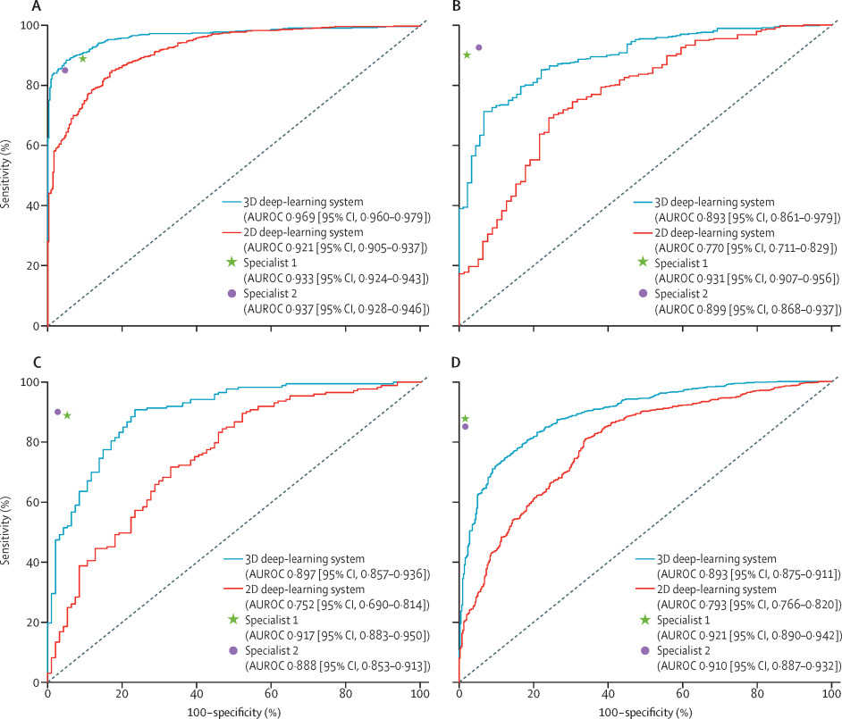
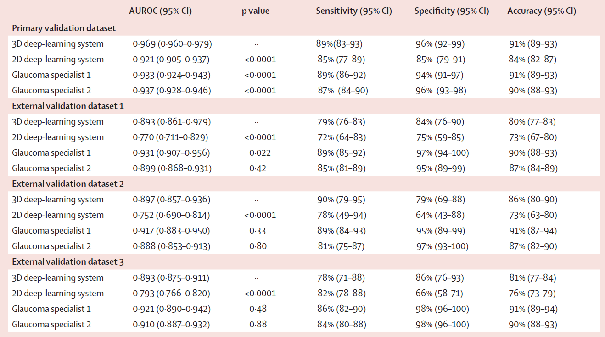
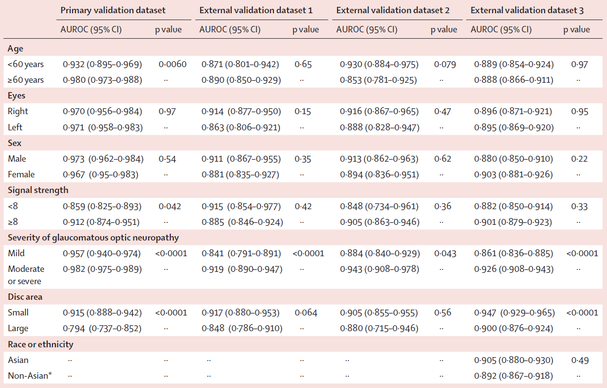

```{r setup, include=FALSE}
knitr::opts_chunk$set(echo = FALSE, fig.pos = "!ht", fig.asp = 0.618,
                      fig.width = 10, out.width = "100%")
i_block = c(0,0,0)
index_block = function(j) {
  i_block[j] <<- i_block[j] +1
  i_block[j]
}
```

# Introduction
## Why detection of GON?
Glaucoma is a major cause of irreversible visual morbidity worldwide

- Projected to affect 111.8 million people by 2040

Early detection of glaucomatous optic neuropathy (GON)

- Difficult as early stages usually experience no symptoms
- Subjective (and expensive) examination of optic neuropathic features
- Essential for timely treatment and minimization of irreversible vision loss

## Why SDOCT?
Spectral-domain optical coherence tomography (SDOCT)

- A non-contact and non-invasive imaging technology for cross-sectional and three-dimensional (3D) viewing of the retina and optic nerve head
- Able to diagnose mild to moderate glaucoma (not just late-stage)
- Monitor disease progression

Advantages of SDOCT

- Good sensitivity and specificity for glaucoma detection
- Useful for screening GON in high-risk communities

Limitations of SDOCT

- Professionals are required to interpret SDOCT results
- Diagnosis based on built-in normative databases could be unreliable
  - small optic discs + long optic axes = high chances of abnormal diagnostic classification, which results in false-positive errors

## Why deep learning?
Deep learning with convolutional neural networks (CNNs)

- Proved to be effective in automated classification of diabetic retinopathy, age-related macular degeneration and other retinal diseases
- Some models are potentially more accurate than certified specialists

Existing CNN-based glaucoma detection

- Seems only 2D-based in the literature before Apr 2019
- Usually quantify glaucomatous damages via fundus photographs
  - thickness of the retinal nerve fibre layer
  - minimum rim width relative to Bruch's membrane opening
- No model available for other features such as
  - optic nerve head structure in the 3D cube
  - inner retinal neuronal layers
  - morphological changes in lamina cribrosa
  
## Ideas on SDOCT
Time-domain optical coherence tomography (TDOCT)

- See [this link](https://www.future-science.com/doi/10.2144/000112090) for an introduction and comparison
- SDOCT can be proved to be intrinsically more sensitive than TDOCT

\begin{exampleblock}{Idea `r index_block(2)`}
Can we apply techniques from spectral analysis to SDOCT data?
\end{exampleblock}

Unreliability related to normative database

\begin{exampleblock}{Idea `r index_block(2)`}
Can we use external data (i.e., outside the medical image) to supplement the analysis? We will discuss this later.
\end{exampleblock}

## Ideas on dimension
Contributions of this paper

- Develop a 3D deep-learning system based on SDOCT volumetric data
- Investigate the system's ability to detect GON

\begin{exampleblock}{Idea `r index_block(2)`}
Can we improve the system with panel data (3D + time = 4D)? This is possible as the patients may revisit the clinic at another time.
\end{exampleblock}

\begin{exampleblock}{Idea `r index_block(2)`}
Can we improve the system with video data? Note that the time dimension here is different from the above.
\end{exampleblock}

## Idea on detection
Glaucomatous damage may not be glaucoma

- See [this link](https://www.reviewofophthalmology.com/article/when-glaucomatous-damage-isnt-glaucoma) for examples
- Detecting GON to predict glaucoma may not be the best choice
- Deep learning works well in prediction (but not yet causation)

\begin{exampleblock}{Idea `r index_block(2)`}
Do we need other relationships (e.g., causation) to prevent glaucoma?
\end{exampleblock}

# Methods
## Main datasets
Training, testing, and primary validation dataset

- Source: CUHK Eye Centre and Hong Kong Eye Hospital
- Date range: March 1, 2015 to Dec 31, 2017
- Participants: 18 years or older, with reliable visual field tests and gradable SDOCT optic nerve head scans
  - also included healthy volunteers who joined for opportunistic screening
- Exclusion: with other ocular or systemic diseases that could cause visual defects, or missing data for visual field tests or SDOCT
- Device: Cirrus HD-OCT. In each gradable SDOCT scan, extract
  - raw 3D volumetric images (main system)
  - 2D line-scanning ophthalmoscope en face image (benchmark purpose)

\begin{alertblock}{Remark `r index_block(3)`}
Note that missing data were discarded but not imputed.
\end{alertblock}

## External datasets
External validation datasets

- Source: independently from
  - Prince of Wales Hospital
  - Tuen Mun Eye Centre
  - Byers Eye Institute, Stanford University
- Criteria: same inclusion, exclusion, visual field, and SDOCT device
  - only date ranges differed

## Ground truth labeling
Assessment of SDOCT images by human graders

- Gradable
  - presence of GON
    - defined by Collaborative Normal-Tension Glaucoma Study Group
    - two glaucoma specialists for HK and Stanford datasets respectively
    - discrepancies were reviewed by a senior glaucoma specialist (HK), resolved by consensus or excluded if no consensus (Stanford)
  - absence of GON (i.e., normal/healthy)
- Not gradable
  - always excluded

## Deep-learning system
Brief specification

- Backbone: ResNet-34 without pretraining
- Input: randomly divided (3:1:1) into training, testing and validation
  - ratios of presence to absence of GON were similar
  - images from the same patient were confined to the same set
  - training-validation curve was assessed to avoid over-fitting

\begin{exampleblock}{Idea `r index_block(2)`}
Can we use other backbone (e.g., VGG) or transfer learning to improve the performance? There are many other ideas in the computer vision literature.
\end{exampleblock}

## 3D deep-learning system


## 2D deep-learning system


## More on the deep-learning system
- Standardization and normalization (zero mean and unit variance)
- Scaling to range from 0 to 1
- Random cropping, jittering/rotating and flipping to alleviate over-fitting
- Weighted binary cross-entropy loss function
  - imbalance training dataset (e.g., 2 ‘yes GON’ to every 1 ‘no GON’)
- Implemented in Keras
  - learning rate: 0.0001 and 0.00001 for 3D and 2D CNN
  - optimization algorithm: Adam
- Other modifications
  - e.g., number of filters in ResNet-34 was halved due to limited memory

\begin{alertblock}{Remark `r index_block(3)`}
The batch size was not reported. From the limited memory consideration, perhaps they did not adjust these hyperparameters.
\end{alertblock}

## Statistical analysis
Hypothesis: performance of the 3D deep-learning system is similar to that of experienced human assessors

- in terms of detection of GON from SDOCT volumetric data
- in both primary and external validations

Tests (all two-sided with $\alpha=0.05$)

- Numerical demographic data: Wilcoxon rank sum test
- Categorical demographic data: $\chi^2$ test
  - also used to analyze variances of data between the different datasets
  
Additional analyses

- Subgroups stratified by age, sex, eye, signal strength, severity of GON, size of disc area and ethnicity
- Number and proportion of eyes with pre-perimetric glaucoma that were predicted to have GON

# Results
## Summary of study participants
I omit the table in the paper here

- it kind of reinforces which factors are more important in detecting GON
- so I consult my friend who is a medical student

)](Detection of GON with SDOCT/risk_factor.jpg){width=240px}

## Performance of the systems
{width=300px}

## Performance of the systems
{width=420px}

## Output of the systems
Videos comparisons available in the [online supplement](https://www.sciencedirect.com/science/article/pii/S2589750019300858#sec1)

- Red–orange-coloured area has the most discriminatory power
- Heatmaps shows potential with other areas covering the lamina cribrosa and choroid in detecting GON
  - in contrast to the traditional retinal nerve fibre layer and neuroretinal rim
- False-negative results: mainly due to small disc area
- False-positive results: mainly due to large disc area

## Subgroups analyses
{width=380px}

## Remark on hypothesis tests
Two sample z-tests were used to compare the AUROC

- Note that the ROCs may not be independent
  - e.g., the 3D and 2D ROCs
  - then problem with variance estimation
- See [this link](https://statisticaloddsandends.wordpress.com/2020/06/07/what-is-the-delong-test-for-comparing-aucs/) for a short discussion

\begin{alertblock}{Remark `r index_block(3)`}
Some statistical tests in the paper may be improvable.
\end{alertblock}

# Discussion
## Implications
Automated detection of GON in SDOCT volumes is possible

- Note that glaucoma should not be diagnosed solely based on SDOCT
  - can detect glaucomatous structural changes
  - can provide preliminary detection
- Performance was similar to experienced glaucoma specialists
- Heatmaps highlighted other potentially useful structures, e.g., choroid
- Some additonal risk factors seem to make no difference in detection
  - age, eye (ie, left vs right), sex, signal strength and ethnicity 
  - performance was worse for mild than moderate or severe GON
  - but the situation is same for experienced ophthalmologists

## Implications
Performance in external validations was slightly reduced. Possible reasons:

- inter-grader and intra-grader variability in assessments of GON
- difference in glaucoma-related features (e.g., severity) between datasets
- different variances in SDOCT raw images among the datasets

2D deep-learning system that was substantially outperformed by the 3D one

- difference in input compared with literature
  - this paper: line-scanning ophthalmoscope images
  - literature: paired colour fundus photographs
- AUROC better than most models in the literature
  - note that it is problematic to directly compare across studies
  - however fundus photography missed features like inner retinal neuronal layers and lamina cribrosa morphology

## Remark on 2D vs 3D
The benchmark comparison is not surprising

- Same data source, only differs in dimension
- 3D images may contain more (hidden) information
- Similar models are used
- Result thus directly reflect data quality

\begin{alertblock}{Remark `r index_block(3)`}
The benchmark comparison is not surprising. However it did illustrate the usefulness of 3D images.
\end{alertblock}

## Strengths
1. External validation datasets were collected from eye clinics in different geographical locations
2. Visual field reports were available for labeling of GON
3. Heatmaps were generated to visualize the discriminative image regions among the SDOCT volumes

\begin{exampleblock}{Idea `r index_block(2)`}
As in the papers we read previously, visualization is important for real applications. Practitioners may not believe the system works without it as deep learning models somehow work like a black box.
\end{exampleblock}

## Limitations
1. Only gradable images were included for training and validation
  - the authors are working on a separate deep-learning algorithm for automated filtering of ungradable SDOCT volumes
2. Only cases of GON that had visual field defects were included
  - plan to include eyes with suspected glaucoma in the next version
3. Only one type of SDOCT device was used
4. Data was collected mostly Chinese participants
  - although diagnostic performance did not differ between Asian and non-Asian patients in the external validation
5. Number of participants without GON was low in the validation datasets
6. Inter-grader and intra-grader variability in ground truth labeling
7. Tried only in clinic-based samples to replicate ophthalmologists' grading