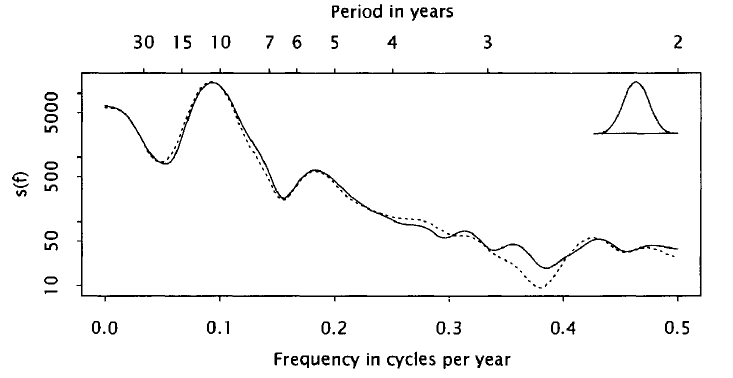

```{r setup, include=FALSE}
knitr::opts_chunk$set(echo = FALSE, fig.pos = "!ht", fig.asp = 0.618,
                      fig.width = 10, out.width = "100%")
library(xts)
wheat.raw = c(17, 19, 20, 15, 13, 14, 14, 14, 14, 11, 16, 19, 23,
              18, 17, 20, 20, 18, 14, 16, 21, 24, 15, 16, 20,
              14, 16, 25.5, 25.8, 26, 26, 29, 20, 18,
              16, 22, 22, 16, 19, 17, 17, 19, 20, 24, 28, 36,
              20, 14, 18, 27, 29, 36, 29, 27, 30, 38, 50, 24,
              25, 30, 31, 37, 41, 36, 32, 47, 42, 37, 34, 36,
              43, 55, 64, 79, 59, 47, 48, 49, 45, 53, 55, 55,
              54, 56, 52, 76, 113, 68, 59, 74, 78, 69, 78, 73,
              88, 98, 109, 106, 87, 77, 77, 63, 70, 70, 63, 61,
              66, 78, 93, 97, 77, 83, 81, 82, 78, 75, 80, 87,
              72, 65, 74, 91, 115, 99, 99, 115, 101, 90, 95, 108,
              147, 112, 108, 99, 96, 102, 105, 114, 103, 98, 103,
              101, 110, 109, 98, 84, 90, 120, 124, 136, 120, 135,
              100, 70, 60, 72, 70, 71, 94, 95, 110, 154, 116,
              99, 82, 76, 64, 63, 68, 64, 67, 71, 72, 89, 114,
              102, 85, 88, 97, 94, 88, 79, 74, 79, 95, 70, 72,
              63, 60, 74, 75, 91, 126, 161, 109, 108, 110, 130,
              166, 143, 103, 89, 76, 93, 82, 71, 69, 75, 134,
              183, 113, 108, 121, 139, 109, 90, 88, 88, 93, 106,
              89, 79, 91, 96, 111, 112, 104, 94, 98, 88, 94, 81,
              77, 84, 92, 96, 102, 95, 98, 125, 162, 113, 94,
              85, 89, 109, 110, 109, 120, 116, 101, 113, 109, 105,
              94, 102, 141, 135, 118, 115, 111, 127, 124, 113,
              122, 130, 137, 148, 142, 143, 176, 184, 164, 146,
              147, 124, 119, 135, 125, 116, 132, 133, 144, 145,
              146, 138, 139, 154, 181, 185, 151, 139, 157, 155,
              191, 248, 185, 168, 176, 243, 289, 251, 232, 207,
              276, 250, 216, 205, 206, 208, 226, 302, 261, 207,
              209, 280, 381, 266, 197, 177, 170, 152, 156, 141,
              142, 137, 161, 189, 226, 194, 217, 199, 151, 144,
              138, 145, 156, 184, 216, 204, 186, 197, 183, 175,
              183, 230, 278, 179, 161, 150, 159, 180, 223, 294,
              300, 297, 232, 179, 180, 215, 258, 236, 202, 174,
              179, 210, 268, 267, 208, 224)
wheat.n = length(wheat.raw)
wheat = xts(x=wheat.raw,
            order.by=seq(as.Date("1500-01-01"), length=wheat.n, by="years"))
```

# The Spectrum

## Introduction
- We focus on the mathematical aspect in previous chapters, e.g.,
  - fitting sinusoids of known/unknown frequency, and
  - the fast Fourier transform (FFT) algorithms.
- We now discuss the statistical aspect with some real data sets.
  - How to do spectral analysis of time series?
  - How to deal with some practical issues such as change in scale?
  - How to interpret the results from spectral analysis?
- The data is available [here](https://www4.stat.ncsu.edu/~bloomfld/FATS/).
  - The link is not up-to-date in the book.
- My code is available [here](Fourier Analysis of Time Series Ch8.Rmd).
  - Modern libraries like xts are used.

# Periodogram Analysis

## Definitions recall
- Discrete Fourier transform (Section 5.1):
$$
d(f_j) = \frac{1}{n} \sum_{t=0}^{n-1} x_t \exp(-2 \pi i f_j t),
\quad j=0,1,\ldots,n-1.
$$
  - Equivalent to fitting sinusoids (Section 4.1)
  
- Periodogram (Section 6.1):
$$
I(f) = n|d(f)|^2.
$$
  - An estimate of the spectrum/spectral density

## Problem: change in scale
- No sinusoids can match oscillations that grow in amplitude
  - Possible cause: inflation?  
```{r, out.width="80%"}
plot(wheat, main="Beveridge's wheat price", bg="transparent")
```

## Beveridge: "index of fluctuation"
- Each value is divided by the average of 31 centered adjacent values
  - Idea: smoothing  
```{r, out.width="80%"}
wheat.fluct = cumsum(wheat.raw)
wheat.fluct = wheat.fluct[32:wheat.n] -wheat.fluct[1:(wheat.n-31)]
wheat.fluct = wheat[16:(wheat.n-16)]/wheat.fluct*31
plot(wheat.fluct, main="Beveridge's index of fluctuation", bg="transparent")
```

## Motivation: unobserved components model
- Proposed by Harvey (1989)
- Bloomfield only considered the trend $T_t$ and irregular component $I_t$
  - Multiplicative model: $x_t = T_t I_t$
  - Additive model: $x_t = T_t +I_t$
- Interpretation for wheat price
  - $T_t$: driven by long-run economic forces such as inflation
  - $I_t$: caused by short-run effects such as changes in supply from year to year
  - $T_t$ is an unwanted complication in the analysis and approximated by 31-year moving average
  - $I_t$ is then estimated by the index of fluctuation
  - Closely related to filtering in Section 7.2

## Problem: spurious periodicities
- Beveridge (1921) gave periodogram ordinates based on index of fluctuation
  - It solved the change in scale problem in analyzing periodicity
  - However, Slutsky pointed out that operations involving linear filtering might lead to spurious periodicities in 1927
  - Intuitively, this means that transformation may distort the original periodicity
    - I try to replicate his estimates but it seems that additional cleanings are necessary (p.139)
    - As the original paper is not found online, I choose to discuss the idea only
- Under multiplicative model, we can correct for the transfer function to mitigate spurious periodicities
  - As also shown by Granger and Hughes (1971)
  - For index of fluctuation, the transfer function is $D_{31}(f)$, a Dirichlet kernel (Section 2.2)
  - After correction, the peak changes as compared with Beveridge (1921)

## (Part of) Beveridge's periodogram


## Logarithmic transformation
- Alternatively, we can do logarithmic transformation under multiplicative model
$$
\ln x_t = \ln T_t +\ln I_t
$$

- Interpretation
  - $\ln T_t$: the typical value of $x_t$ in the neighborhood of $t$
  - $I_t$: a dimensionless quantity close to 1 so that $\ln I_t$ fluctuates around 0
- Vs index of fluctuation
  - Nonsinusoidal behavior of a series introduce structure into its Fourier transform
  - However, they are not revealed by the periodogram (Section 6.5)
  - Logarithms can reduce this behavior such as spikiness of the peaks
    - Reasonable as we are interested in $I_t$ but not the extreme behaviors

## Logarithmic transformation
```{r, out.width="90%"}
wheat.log = log(wheat)
plot(wheat.log, main="Log wheat price", bg="transparent")
```

## Data cleaning
- Beveridge (1921) argued that the early part of the series was unreliable due to fewer sources
- The later part was of a different nature due to economic changes in the 19th century
  - I have not looked into wheat market history but it sounds reasonable
  - We should also be aware of the underlying structure/data quality when we perform statistical analysis
- After clearning, the periodogram of logarithms and index of fluctuation are similar

## Data cleaning


## Analysis of segments: idea
- Idea: if there is periodicity in a series, it should hold for segments of the same series
- Beveridge (1921) also gave some terms from the periodogram of two halves of the series


## Analysis of segments: wheat price
- The two periodograms have the same general shape
  - Large at lowest frequencies and show a broad peak between 0.06 and 0.10 cycles per year
  - Then show a gentle decline over the rest of the periodogram with small fluctuations
- However, the fine structures are quite unrelated
  - A local peak in one is just as likely to be matched by a local trough as a local peak in the other
- These shows that the fine strucuture is not repeated from one segment to the next
  - But the broad features show a statistical regularity or consistency across segments
    - I think these terms can be confusing in the literature
- Thus the fine structure of these two periodograms is not characteristic of the series as a whole
  - Broad features do not appear to vary in this way and may be characteristic of the whole series
  - In contrast, the periodograms of the variable star data have similar fine structures

## Analysis of segments: variable stars


## Analysis of segments: conclusion
- Bloomfield is trying to motivate the concept of spectrum here
  - A raw periodogram may not be useful
    - For variable star, it is directly useful
    - For wheat price, the fine structure should be suppressed to focus on the broad behavior
  - This suggests a smoothed periodogram
    - So that periodograms of segments may be regarded as the same underlying smooth curve
    - Such smooth curve is called the spectrum or spectral density of the series
    - Spectrum exists for many time series models (Chapter 9)

# Spectrum Estimation

## Bartlett's method
- Suggested by Bartlett (1948)
1. Split the series into $k$ non-overlapping segments of similar length
2. For each segment, compute its periodogram
3. Average the result of the periodograms above for the $k$ segments
- Welch's method: allow overlapping
  - It can reduce noise in exchange for reducing the frequency resolution
  - Often desirable in finite sample
- Average of logarithms or logarithms of averages can both be used
  - The latter is preferred since it puts more weight on larger values
  - Small values are the most susceptible to perturbations such as leakage from other frequencies

## Bartlett's method


## Bartlett spectrum estimate
- To understand the effect of Bartlett's method, we try to find the "periodogram" that it is producing
- For simplicity, Bloomfield assumed $x_t$ are deviations around 0
  - If they are not, we can do demean and arrive at a similar result

- Now note that
$$
\begin{aligned}
I(f) &= n |d(f)|^2 = n \cdot d(f) \cdot \overline{d(f)} \\
&= \frac{1}{n} \sum_t \sum_{t'} x_t x_{t'} \exp\big\{ -2\pi i f(t-t') \big\}.
\end{aligned}
$$
- As $t-t' \in [-n+1, n-1] \cap \mathbb{Z}$, we can rewrite the above as
$$
\begin{aligned}
I(f) &= \frac{1}{n} \sum_{r=-n+1}^{n-1} \sum_{t-t'=r} x_t x_{t'} \exp(-2\pi i f r) \\
&= \frac{1}{n} \sum_{r=-n+1}^{n-1} \exp(-2\pi i f r) \sum_{t-t'=r} x_t x_{t'}.
\end{aligned}
$$

## Bartlett spectrum estimate
- We can see that the periodogram is itself a Fourier series with $n^{-1} \sum_{t-t'=r} x_t x_{t'}$ as the coefficients
- Some manipulation yields
$$
I(f) = \sum_{|r|<n} c_r \exp(-2\pi i f r)
\quad \textrm{with} \quad
c_r = \left\{
	\begin{array}{ll}
		n^{-1} \sum_{t=r}^{n-1} x_t x_{t-r}, & r \ge 0; \\
		c_{-r}, & r < 0. \\
	\end{array}
\right.
$$
  - If you are familiar with time series, $c_r$ is the sample autocovariance of $\{x_t\}$ at lag $r$
    - Estimating the autocovariance structure is equivalent to estimating the spectrum
    - This also explains long run variance is the normalized spectrum at frequency 0

- In light of the symmetry of the autocovariances, we can also write
$$
I(f) = c_0 + \sum_{r=1}^{n-1} c_r \cos(2\pi f r).
$$

## Bartlett spectrum estimate
- Suppose the data are divided into $k$ non-overlapping segments of length $m = n/k$
  - $I_j(f)$: the periodogram of the $j$-th segment
  - $c_{j,r}$: the autocovariance of the $j$-th segment at lag $r$

- The average of these periodogram is
$$
\begin{aligned}
\hat{s}(f) &= \frac{1}{k} \sum_{j=1}^k I_j(f) = \sum_{|r|<m} \left( \frac{1}{k} \sum_{j=1}^k c_{j,r} \right) \exp(-2\pi i f r) \\
&= \sum_{|r|<m} \left( 1 -\frac{|r|}{m} \right) \frac{1}{k(m-|r|)} \sum_{j=1}^k m c_{j,r} \exp(-2\pi i f r).
\end{aligned}
$$

- Now $\sum_{j=1}^k m c_{j,r}$ is like $nc_r$, a sum of products of the form $x_t x_{t+r}$
  - Except that the term is included only if $x_t$ and $x_{t+r}$ fall into the same segment
  - So $\{k(m-|r|)\}^{-1} \sum_{j=1}^k m c_{j,r}$ is the average of these products
  - It makes sense to replace with $nc_r/(n-|r|)$ (whole series version)

## Bartlett spectrum estimate
- Replacing $\{k(m-|r|)\}^{-1} \sum_{j=1}^k m c_{j,r}$ with $nc_r/(n-|r|)$, the modified version is
$$
\hat{s}_{B}(f) = \sum_{|r|<m} \frac{1-|r|/m}{1-|r|/n} c_r \exp(-2\pi i f r)
= \sum_{|r|<m} w_r c_r \exp(-2\pi i f r),
$$
  - where $w_r = (1-|r|/m)/(1-|r|/n)$.
  - $\hat{s}_{B}(f)$ is known as the Bartlett spectrum estimate
  - $w_r$ is the weight at lag $r$
- Vs periodogram
  - All terms with $|r| \ge m$ will be omitted
  - The remaining terms are progressively reduced in magnitude by the weight $w_r$
  - Both effects make $\hat{s}_{B}(f)$ smoother than the periodogram
  - Varying the truncation point $m$ provides control over the degree of smoothness
    - $m$ is also called the bandwidth
  - However, $\hat{s}_{B}(f)$ is not guaranteed to be positive unlike $I(f)$

## Bartlett spectrum estimate


## Smoothing the periodogram
- The Bartlett spectrum estimate motivates smoothing the periodogram with other data windows $w_r$
  - A significant property is that $w_r$ decays from 1 when $r=0$ to 0 when $r=\pm m$
    - This is common but not necessary, at least for long run variance estimation
    - See, e.g., Andrews (1991)
  - Anderson (1994) lists the most commonly used windows and their properties
  - Bartlett window is the only window that decays linearly and rarely used in practice
    - I think Bartlett window is quite popular, at least for long run variance estimation as well
    - It is also computationally efficient for spectrum estimation. See Xiao and Wu (2011)
- The smoothing strategy is attractive when the truncation point $m$ is small
  - Only $m$ autocovariances need to be computed
  - If $m$ is large, the autocovariances can be computed efficiently using FFT and its inverse

## Computing the autocovariances
- From previous derivation (p.144), we know that the periodogram is itself a Fourier series
- This raises the possibility of using FFT to obtain autocovariance estimates
- When the periodogram is evaluated at a Fourier frequency $f_j = j/n$,
$$
I(f_j) = \sum_{r=0}^{n-1} (c_r +c_{n-r}) \exp(-2\pi i f_j r),
$$
  - provided that $c_r$ is defined to be 0 for $|r| \ge n$.

- Therefore, we have
$$
c_r +c_{n-r} = \frac{1}{n} \sum_{j=0}^{n-1} I(f_j) \exp(2\pi i f_j r),
$$
  - which may be computed using inverse FFT.
  - However, $c_{r}$ is not symmetric with $c_{n-r}$
  - This computation is only fine for small $r$ as giving approximations of $c_r$

## Computing the autocovariances
- The problem of $c_r +c_{n-r}$ can be solved by using a finer grid $f'_j=j/n'$ for some $n' > n$
- We can pad the data with a block of $n'-n$ zeros. Then
$$
I(f'_j) = \sum_{r=0}^{n-1} (c_r +c_{n'-r}) \exp(-2\pi i f'_j r).
$$
- Inversion now gives
$$
c_r +c_{n'-r} = \frac{1}{n'} \sum_{j=0}^{n'-1} I(f'_j) \exp(2\pi i f'_j r),
$$
  - which yields $c_0, c_1, \ldots, c_{n'-n}$ exactly.
  - If $n'=2n-1$, all autocovariance estimates are obtained.
    - Note that $I(f'_j)$ only sum to $n-1$
    - Probably why the zeros may not contaminate the estimates
  - FFT costs $O(n \log n)$ times, which is faster than brute force $O(n^2)$

## Representation of a spectrum estiamte
- Suppose a spectrum estimate is given by $\hat{s}(f) = \sum_{|r|<n} w_r c_r \exp(-2\pi i f r)$,
  - where a truncation point $m$ is no longer assumed.
- By the integral inversion formula (p.40), we have $c_r = \int_0^1 I(f) \exp(2\pi i f r) df$.
  - Then $\hat{s}(f) = \int_0^1 W_n(f-f') I(f') df'$,
  - where $W_n(f) = \sum_{|r| < n} w_r \exp(-2 \pi i f r)$.
- Therefore, any $\hat{s}(f)$ of the above form may be written as an integral average of $I(f)$
  - The $W_n(f)$ is called the spectral window associated with the spectral estimate
    - There is one-to-one relationship between $W_n(f)$ and $w_r$

## Spectral window
- The spectral window of the Bartlett estimate has no closed form
  - The window is $w_r = (1-|r|/m)/(1-|r|/n)$

- Modified Bartlett estimate
  - The window is $w_r = (1-|r|/m)\mathbb{I}_{|r|<m}$
  - The corresponding spectral window is
$$
W_n(f) = \sum_{|r|<m} \left( 1 -\frac{|r|}{m} \right) \exp(-2\pi i f r)
= m D_m(f)^2,
$$
  - where $D_m(f)$ is the Dirichlet kernel (Section 2.2).
- If the spectral window and periodogram are both nonnegative,
  - then the spectrum estimate is guaranteed to be nonnegative.
    - Important in long run variance estimation

## Spectral window


## Modified Bartlett spectrum estimate
- The central peak in the spectral window of the modified Bartlett estimate is of height $m$
- The first zeros on either side are at $f=\pm 1/m$ cycles per unit time
- However, a sizable proportion of the mass is contained in the sidelobes which decay slowly
- The periodogram values at some distance from $f$ may also contribute substantially to the integral
- The estimated spectrum in one frequency may be swamped by leakage from another with high power
  - Even when these bands are not adjacent
  - Such leakage is different than the leakage in the periodogram itself
  - The major source is the sidelobes in the smoothing spectral window
- The sidelobes of the modified Bartlett window are larger and decay more slowly
  - As compared with Anderson (1994)
  - Thus it is rarely used
- Note that sidelobes are bound to exist for any spectrum estimates with truncation point $m$

## Another representation of a spectrum estiamte
- From the representation $\hat{s}(f) = \int_0^1 W_n(f-f') I(f') df'$, we have
$$
\hat{s}(f) = \int_0^1 W(f') I(f-f') df',
$$
  - for suitable function $W(f)$.
- Furthermore, we can write $w_r = \int_0^1 W(f) \exp(2\pi i f r) df$.
  - Mathematically, $w_r$ are the Fourier coefficients of $W(f)$
  - $W_n(f)$ is a partial sum of the Fourier series for $W(f)$
    - Recall $W_n(f)$ is the spectral window
    - I understand this as constructing $w_r$ reversely from the spectral window
- Daniell (1946) suggested $W(f) = (2\delta)^{-1} \mathbb{I}_{|f| < \delta}$.
  - The resulting estimate is the integral analog of simple moving average filer (Section 7.2)
  - It may be applied successively to build up more complex filter (p.157)
- I will skip the remaining of Section 8.5 which discuss the computation of discrete $\hat{s}(f)$

## Choice of a spectral window
- Four factors need to be considered when choosing a spectral window:
  - Resolution or bandwidth
  - Stability
  - Leakage
  - Smoothness
- Resolution: the ability of a spectrum estimate to represent fine structure in the frequency
  - Such as narrow peaks in the spectrum
  - A narrow peak in the periodogram is usually spread out into a broader peak in the spectrum
  - This peak is roughly an image of the spectral window and its width is the bandwidth
  - If the spectrum contains two close narrow peaks, they may overlap and form a single peak
  - In this case, the estimate has failed to resolve the peaks
- Stability: the extent to which estimates from different segments agree
  - In other words, it is the ability to remove irrelevant fine structure
  - Resolution and stability are conflicting requirements
    - Easy to see by definition
  - Section 9.5 gives a statistical treatment of the stability of spectrum estimates

## Choice of a spectral window
- Leakage
  - Caused by sidelobes in the spectral window
  - Always exists if there is a nontrivial truncation point $m < n$
  - The computationally simpler discrete spectral averages (Section 8.5) can avoid leakage entriely
    - The part that I skip
  - First, use a data window to control leakage in the periodogram
  - Second, use a spectral window of a desired compact form
- Smoothness
  - Less tangible but important in visualization
  - The need for smoothness can introduce further conflict in choosing a window
  - Bloomfield gave an example of Daniell estimate here
  - Repeated smoothing is possible but yields a less stable estimate

## Example: wheat price


## Example: wheat price


## Example: sunspot
- For sunspot data, the spectral weights have the same span as the wheat price
  - Which means they cover the same number of periodogram ordinates
  - However, they are smoother and have a narrower peak
  - The spectral estimates correspondingly show more rounded but slightly larger fluctuations
  - This argument is made more precise in Chapter 9
- For the square root transformation, refer to Section 6.7 for the idea
- Further discussion of the choice of a spectral window available in Jenkins (1961) and Parzen (1961)
  - I try to find a more recent survey but have not yet found one

## Example: sunspot


## Reroughing the spectrum
- Recall repeated smoothing may yield a less stable estimate
  - This seems to be the case for the wheat price spectrum
  - The trough between the two peaks at $f=0$ and $f=0.07$ is not as clear as it is before second smoothing
  - Such loss of resolution suggests the possibility of oversmoothing
  - Similar probelm appears in the sunspot spectra
  - This motivates the idea of reroughing or twicing (Tukey, 1977)
  
- In the context of linear filters, we have rough = input - output
- Since spectra are nonnegative, we can instead define rough = input/output
- To be specific, we can define the rough in spectrum estimation as
$$
r(f) = \frac{I(f)}{\hat{s}(f)}.
$$

## Reroughing the spectrum
- If $\hat{s}(f)$ suffers from oversmoothing,
  - there are narrow-band features in the periodogram that were not fully transferred to $\hat{s}(f)$.
  - They will appear partially in $r(f)$, which can be extracted with another round of smoothing:

$$
\tilde{r}(f) = \sum_u g_u r(f-f_u).
$$
- The reroughted spectrum estimate is $\hat{s}_r(f) = \tilde{r}(f) \hat{s}(f)$.
  - If the same filter is used in the second round as in the first, the process is called twicing

## Example: wheat price


## Example: sunspot


## Prewhitening
- Reroughing is closely related to prewhitening (Blackman and Tukey, 1959)
- Oversmoothing leads to leakage from frequency bands with high power to adjacent bands 
  - From this perspective, oversmoothing is caused by a large dynamic range in the spectrum
- Prewhitening is a technique for reducing dynamic range prior to forming the periodogram
  - It reduces the leakage and allows the use of a more stable estimate with lower resolution
  - The simplest form of prewhitening is replacing the data by their first differences
    - I think differencing is also used as stationary transformation in practice
- Vs reroughing
  - Reroughing is an enhancement to spectrum estimation
  - Prewhitening is a form of preprocessing

# Concluding Remarks

## Comments
- Periodogram analysis
  - Some practical problems and their solutions are covered
  - The statistical regularity over different segments remains a concern
- Spectrum estimation
  - Smoothing the periodogram to focus on the broad behavior
  - From Fourier transform form to autocovariance form
  - Data windows and their corresponding spectral window
  - Choice of spectral window
  - Reroughing and prewhitening